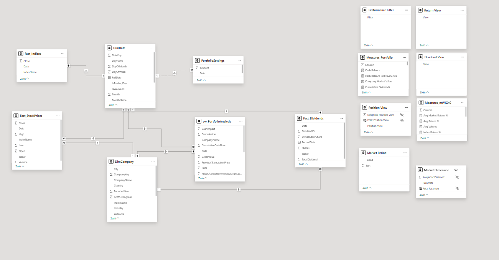
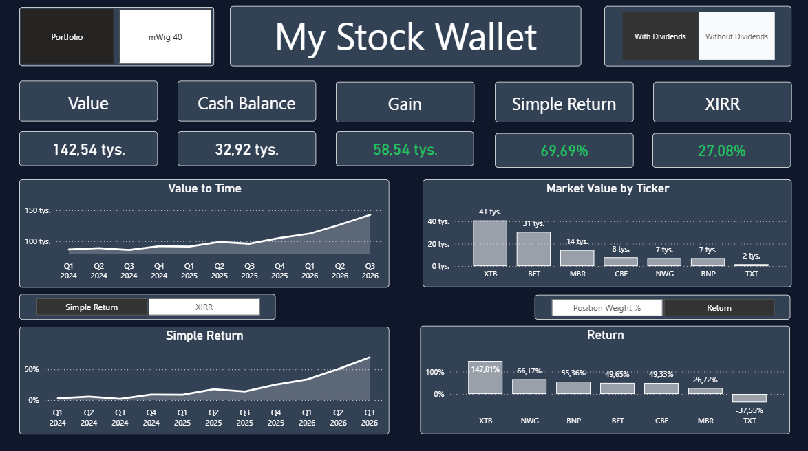
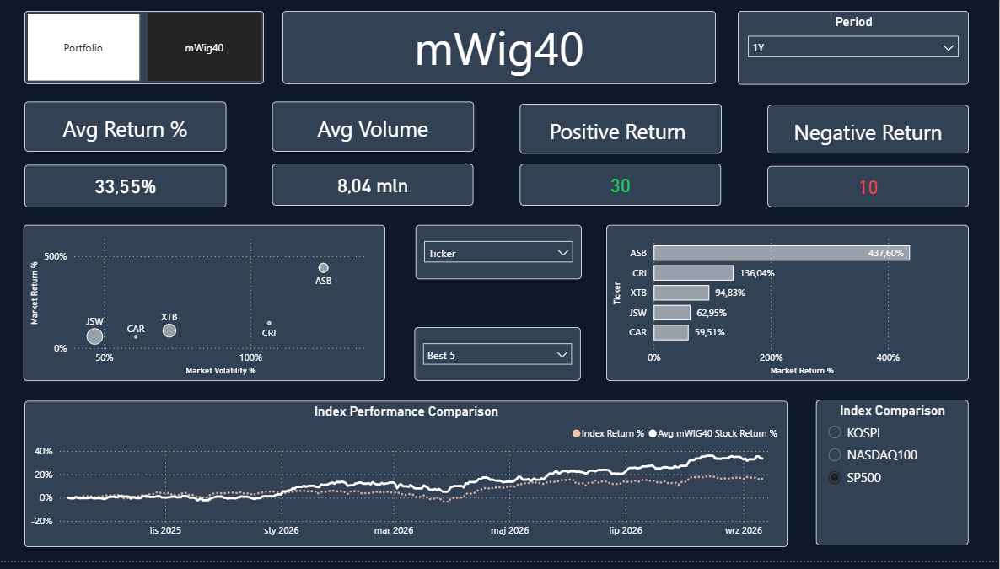

#  mWIG40 & Personal Portfolio Analytics

> End-to-end data analytics project combining Python, SQL Server and Power BI to analyze a personal investment portfolio and companies included in the Polish mWIG40 index.

**🇵🇱 Polski | 🇬🇧 English below**

---

# 🇵🇱 Polski

## O projekcie

**mWIG40 & Personal Portfolio Analytics** to projekt analityczny łączący dane dotyczące mojego portfela inwestycyjnego z danymi rynkowymi spółek należących do indeksu mWIG40.

Celem projektu było stworzenie kompletnego rozwiązania analitycznego — od pobrania i przygotowania danych, przez ich przechowywanie i transformację w SQL Server, aż po stworzenie interaktywnego modelu analitycznego i dashboardu w Power BI.

Projekt został zbudowany jako połączenie:

- Python / pandas — pobieranie i przygotowanie danych,
- SQL Server — przechowywanie i transformacja danych,
- Power BI — model danych, DAX i wizualizacja,
- GitHub — dokumentacja i wersjonowanie projektu.

---

##  Cele projektu

Projekt został zaprojektowany w celu odpowiedzi na pytania takie jak:

- Jak zmienia się wartość mojego portfela w czasie?
- Jaka jest stopa zwrotu z portfela?
- Jak wyniki poszczególnych spółek wpływają na cały portfel?
- Jak portfel wypada w porównaniu z wybranymi indeksami?
- Jak wygląda zachowanie spółek należących do mWIG40?
- Jaki wpływ na wynik portfela mają wypłacone dywidendy?
- Jak wyniki poszczególnych spółek zmieniają się w zależności od wybranego okresu?
- Które spółki i sektory mają największy udział w analizowanym portfelu?

---

##  Technologie

| Technologia | Zastosowanie |
|---|---|
| **Python** | Pobieranie i przygotowanie danych rynkowych |
| **pandas** | Transformacja i przygotowanie danych |
| **yfinance** | Pobieranie danych rynkowych |
| **SQL Server Express** | Przechowywanie danych |
| **SQL** | Transformacje, widoki i przygotowanie danych |
| **Power BI Desktop** | Model danych i dashboard |
| **DAX** | Miary i obliczenia analityczne |
| **Git / GitHub** | Wersjonowanie i dokumentacja |

---

## Architektura rozwiązania

                Yahoo Finance
                     │
                     ▼
                  Python
              pandas / yfinance
                     │
                     ▼
                SQL Server
                     │
          ┌──────────┴──────────┐
          │                     │
    Fact Tables          Dimension Tables
          │                     │
          └──────────┬──────────┘
                     ▼
                  Power BI
                     │
              Data Model + DAX
                     │
                     ▼
             Interactive Dashboard

             
##  Python Data Pipeline

Python odpowiada za automatyczne pobieranie, przygotowanie i zapis danych rynkowych do SQL Server.

### Dane spółek mWIG40

Lista spółek należących do indeksu **mWIG40** jest pobierana dynamicznie z **Bankier.pl** podczas każdego uruchomienia pipeline'u.

Na podstawie aktualnej listy tickerów skrypt pobiera z **Yahoo Finance** historyczne dane cenowe spółek i zapisuje je do tabeli `Fact_StockPrices`.

Dla każdej spółki pobierane są m.in.:

- `Open`
- `High`
- `Low`
- `Close`
- `Volume`
- `Date`

Dzięki dynamicznemu pobieraniu listy tickerów skład analizowanych spółek nie musi być definiowany ręcznie w kodzie.

### Dane indeksów

Pipeline pobiera również historyczne dane wybranych indeksów, które są wykorzystywane w Power BI jako benchmarki:

| Indeks | Yahoo Finance Ticker |
|---|---|
| S&P 500 | `^GSPC` |
| NASDAQ 100 | `^NDX` |
| KOSPI | `^KS11` |

Dla indeksów pobierana jest **data oraz wartość zamknięcia (`Close`)**, a dane są zapisywane w tabeli `Fact_Indices`.

### Dynamiczny zakres danych

Zakres pobieranych danych jest automatycznie określany na podstawie bieżącej daty.

Pipeline utrzymuje dane obejmujące:

**bieżący rok + dwa pełne lata historyczne.**

Przykładowo, w 2026 roku dane są pobierane od `2024-01-01` do bieżącej daty.

Dodatkowo zastosowano mechanizm **incremental loading**. Dla każdej spółki skrypt sprawdza ostatnią dostępną datę w `Fact_StockPrices` i pobiera tylko brakujące dane.

##  SQL Server

SQL Server pełni w projekcie rolę warstwy przechowywania i przygotowania danych pomiędzy Pythonem a Power BI.

Dane pobrane przez pipeline Python są zapisywane w lokalnej bazie **SQL Server Express**, gdzie łączone są z danymi dotyczącymi mojego portfela inwestycyjnego.

### Struktura bazy danych

Baza `mWIG40_Portfolio` składa się z tabel faktów, wymiarów, tabeli konfiguracyjnej oraz widoku przygotowującego dane do analizy.

| Obiekt | Typ | Zastosowanie |
|---|---|---|
| `Fact_StockPrices` | Fact | Historyczne dane cenowe spółek mWIG40 |
| `Fact_Indices` | Fact | Historyczne dane wybranych indeksów |
| `Fact_Transactions` | Fact | Transakcje kupna i sprzedaży |
| `Fact_Dividends` | Fact | Dane dotyczące wypłaconych dywidend |
| `DimCompany` | Dimension | Informacje o analizowanych spółkach |
| `DimDate` | Dimension | Kalendarz wykorzystywany w analizie |
| `DimTransactionType` | Dimension | Typy transakcji BUY / SELL |
| `PortfolioSettings` | Configuration | Parametry wykorzystywane w analizie portfela |
| `vw_PortfolioAnalysis` | View | Przygotowanie danych transakcyjnych do analizy |

### Widok `vw_PortfolioAnalysis`

W projekcie utworzono widok `vw_PortfolioAnalysis`, który przygotowuje dane transakcyjne do dalszej analizy w Power BI.

Widok łączy dane z `Fact_Transactions` z informacjami o spółkach i typach transakcji, a następnie wylicza m.in.:

- wartość brutto transakcji,
- zmianę liczby posiadanych akcji,
- wpływ transakcji na przepływy pieniężne,
- skumulowaną liczbę posiadanych akcji,
- skumulowany przepływ pieniężny,
- zmianę ceny względem poprzedniej transakcji.

Przy tworzeniu widoku wykorzystano m.in.:

- **CTE (Common Table Expressions)**,
- **LEFT JOIN**,
- wyrażenia **CASE WHEN**,
- funkcje okna **SUM() OVER()**,
- funkcję **LAG()**,
- **PARTITION BY** i **ORDER BY** do analizy danych w czasie.

Przykładowo, funkcje okna pozwalają wyznaczyć narastającą liczbę posiadanych akcji oraz skumulowany przepływ pieniężny.

##  Power BI

Power BI stanowi warstwę analityczną i wizualizacyjną projektu. Dane przygotowane w SQL Server są wykorzystywane do stworzenia modelu danych, miar DAX oraz interaktywnego dashboardu.

### Model danych

Model został zaprojektowany w oparciu o tabele faktów i wymiarów.

Główne elementy modelu obejmują:

- dane cenowe spółek mWIG40,
- dane indeksów wykorzystywanych jako benchmarki,
- transakcje portfela,
- dane dotyczące dywidend,
- informacje o spółkach,
- tabelę kalendarza,
- typy transakcji.

Model pozwala analizować dane na poziomie całego portfela, pojedynczych spółek oraz sektorów.

### DAX

Miary DAX zostały wykorzystane do obliczania kluczowych wskaźników oraz dynamicznej analizy danych.

W projekcie wykorzystano m.in.:

- wartość portfela,
- stopę zwrotu,
- **Simple Return**,
- **XIRR** uwzględniający przepływy pieniężne,
- wynik poszczególnych spółek,
- średni zwrot spółek mWIG40,
- wpływ dywidend,
- udział spółek i sektorów w portfelu.

Miary zostały przygotowane tak, aby reagowały na wybór zakresu dat oraz pozostałe filtry użytkownika.

### Interaktywność

Dashboard wykorzystuje funkcjonalności Power BI pozwalające użytkownikowi dynamicznie zmieniać sposób analizy, m.in.:

- wybór zakresu czasu,
- filtrowanie spółek i sektorów,
- przełączanie analizowanych metryk,
- wybór benchmarku,
- przełączanie widoków za pomocą przycisków i zakładek.

### Struktura raportu

Raport został podzielony na dwa główne obszary:

#### Personal Portfolio

Analiza wyników i struktury mojego portfela inwestycyjnego, obejmująca m.in. wartość portfela, stopę zwrotu, wyniki poszczególnych spółek oraz wpływ dywidend.

#### mWIG40 Analysis

Analiza spółek należących do indeksu mWIG40, obejmująca m.in. średni zwrot, wyniki poszczególnych tickerów, sektory oraz porównanie z wybranymi benchmarkami.

# 🇬🇧 English

## About the Project

**mWIG40 & Personal Portfolio Analytics** is an analytical project combining data related to my investment portfolio with market data for companies included in the mWIG40 index.

The goal of the project was to create a complete analytical solution — from data collection and preparation, through data storage and transformation in SQL Server, to the creation of an interactive analytical model and dashboard in Power BI.

The project was built as a combination of:

- Python / pandas — data collection and preparation,
- SQL Server — data storage and transformation,
- Power BI — data model, DAX and visualization,
- GitHub — project documentation and version control.

---

## Project Goals

The project was designed to answer questions such as:

- How does the value of my portfolio change over time?
- What is the return on my portfolio?
- How do the results of individual companies affect the overall portfolio?
- How does the portfolio perform compared to selected indices?
- How do companies included in the mWIG40 index perform?
- What impact do paid dividends have on portfolio performance?
- How do the results of individual companies change depending on the selected period?
- Which companies and sectors have the largest share in the analyzed portfolio?

---

## Technologies

| Technology | Application |
|---|---|
| **Python** | Market data collection and preparation |
| **pandas** | Data transformation and preparation |
| **yfinance** | Market data retrieval |
| **SQL Server Express** | Data storage |
| **SQL** | Transformations, views and data preparation |
| **Power BI Desktop** | Data model and dashboard |
| **DAX** | Measures and analytical calculations |
| **Git / GitHub** | Version control and documentation |

---

## Solution Architecture

                     Yahoo Finance
                          │
                          ▼
                       Python
                   pandas / yfinance
                          │
                          ▼
                     SQL Server
                          │
              ┌───────────┴───────────┐
              │                       │
        Fact Tables           Dimension Tables
              │                       │
              └───────────┬───────────┘
                          ▼
                       Power BI
                          │
                   Data Model + DAX
                          │
                          ▼
                  Interactive Dashboard

##  Python Data Pipeline

Python is responsible for automatically retrieving, preparing and storing market data in SQL Server.

### mWIG40 Company Data

The list of companies included in the **mWIG40** index is dynamically retrieved from **Bankier.pl** each time the pipeline is executed.

Based on the current list of tickers, the script retrieves historical price data from **Yahoo Finance** and stores it in the `Fact_StockPrices` table.

For each company, the following data is retrieved:

- `Open`
- `High`
- `Low`
- `Close`
- `Volume`
- `Date`

Thanks to dynamically retrieving the ticker list, the composition of the analyzed companies does not have to be defined manually in the code.

### Index Data

The pipeline also retrieves historical data for selected indices, which are used as benchmarks in Power BI:

| Index | Yahoo Finance Ticker |
|---|---|
| S&P 500 | `^GSPC` |
| NASDAQ 100 | `^NDX` |
| KOSPI | `^KS11` |

For the indices, the **date and closing value (`Close`)** are retrieved, and the data is stored in the `Fact_Indices` table.

### Dynamic Data Range

The data retrieval range is automatically determined based on the current date.

The pipeline maintains data covering:

**the current year + two complete historical years.**

For example, in 2026, data is retrieved from `2024-01-01` up to the current date.

An **incremental loading** mechanism has also been implemented. For each company, the script checks the latest available date in `Fact_StockPrices` and retrieves only the missing data.

##  SQL Server

SQL Server serves as the data storage and preparation layer between Python and Power BI.

Data retrieved by the Python pipeline is stored in a local **SQL Server Express** database, where it is combined with data related to my investment portfolio.

### Database Structure

The `mWIG40_Portfolio` database consists of fact tables, dimension tables, a configuration table and a view used to prepare data for analysis.

| Object | Type | Application |
|---|---|---|
| `Fact_StockPrices` | Fact | Historical price data for mWIG40 companies |
| `Fact_Indices` | Fact | Historical data for selected indices |
| `Fact_Transactions` | Fact | Buy and sell transactions |
| `Fact_Dividends` | Fact | Paid dividend data |
| `DimCompany` | Dimension | Information about analyzed companies |
| `DimDate` | Dimension | Calendar used in the analysis |
| `DimTransactionType` | Dimension | Transaction types BUY / SELL |
| `PortfolioSettings` | Configuration | Parameters used in portfolio analysis |
| `vw_PortfolioAnalysis` | View | Preparation of transaction data for analysis |

### `vw_PortfolioAnalysis` View

The `vw_PortfolioAnalysis` view was created to prepare transaction data for further analysis in Power BI.

The view combines data from `Fact_Transactions` with information about companies and transaction types, and then calculates, among other things:

- gross transaction value,
- change in the number of shares held,
- transaction impact on cash flow,
- cumulative number of shares held,
- cumulative cash flow,
- price change compared to the previous transaction.

The following were used when creating the view:

- **CTEs (Common Table Expressions)**,
- **LEFT JOIN**,
- **CASE WHEN** expressions,
- window functions **SUM() OVER()**,
- the **LAG()** function,
- **PARTITION BY** and **ORDER BY** for time-based analysis.

For example, window functions allow the calculation of the cumulative number of shares held and cumulative cash flow.

##  Power BI

Power BI serves as the analytical and visualization layer of the project. Data prepared in SQL Server is used to create the data model, DAX measures and interactive dashboard.

### Data Model

The model was designed based on fact and dimension tables.

The main elements of the model include:

- mWIG40 company price data,
- index data used as benchmarks,
- portfolio transactions,
- dividend data,
- company information,
- calendar table,
- transaction types.

The model allows data to be analyzed at the level of the entire portfolio, individual companies and sectors.

### DAX

DAX measures are used to calculate key indicators and perform dynamic data analysis.

The project includes, among others:

- portfolio value,
- return,
- **Simple Return**,
- **XIRR** including cash flows,
- individual company performance,
- average return of mWIG40 companies,
- impact of dividends,
- company and sector share in the portfolio.

The measures have been designed to respond to the selected date range and other user filters.

### Interactivity

The dashboard uses Power BI functionality that allows the user to dynamically change the way the data is analyzed, including:

- selecting the time range,
- filtering companies and sectors,
- switching between analyzed metrics,
- selecting a benchmark,
- switching between views using buttons and tabs.

### Report Structure

The report is divided into two main areas:

#### Personal Portfolio

Analysis of the performance and structure of my investment portfolio, including portfolio value, return, individual company performance and the impact of dividends.

#### mWIG40 Analysis

Analysis of companies included in the mWIG40 index, including average return, individual ticker performance, sectors and comparison with selected benchmarks.

